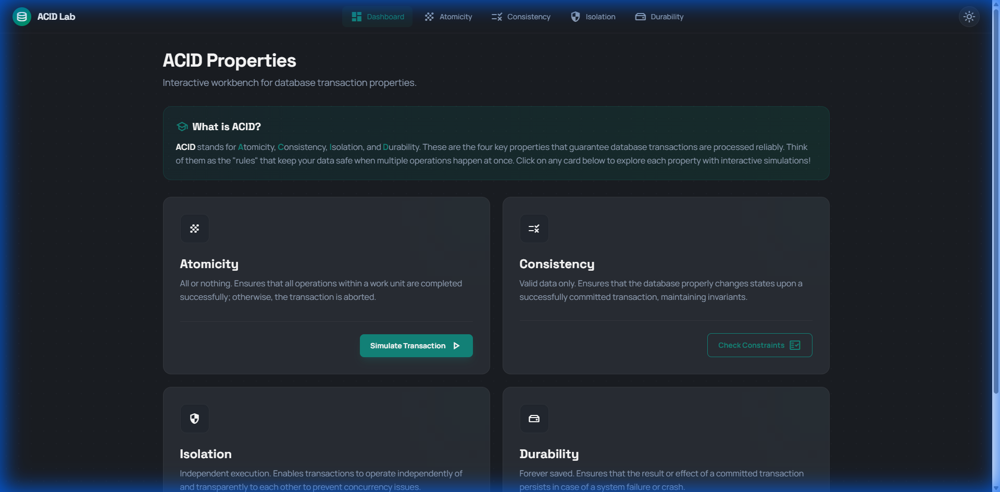
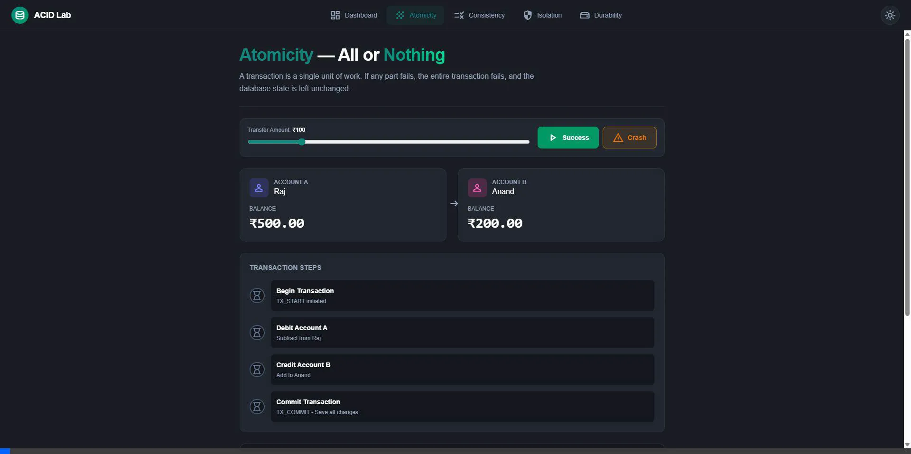
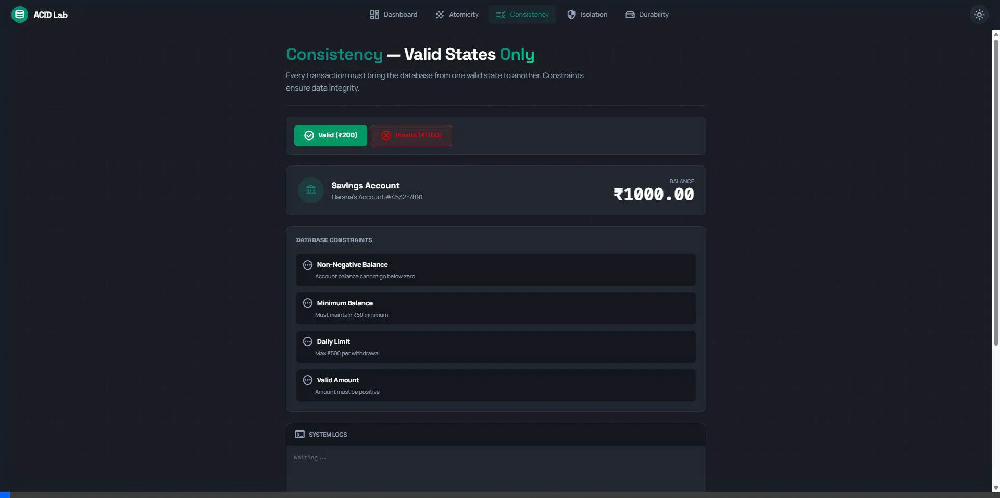
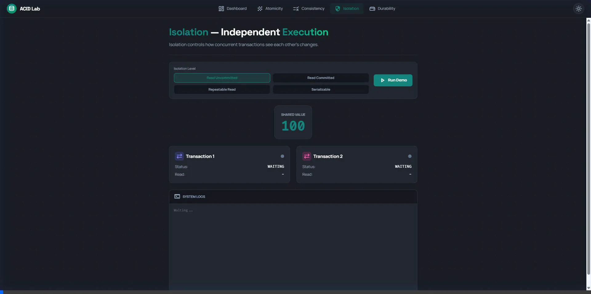

# 🧪 ACID Lab: Database Property Simulator

[](https://github.com/rajanand/acid-properties)
[](https://nextjs.org/)
[](https://react.dev/)
[](https://tailwindcss.com/)
[](https://opensource.org/licenses/MIT)

An interactive, production-grade educational platform designed to demystify the core pillars of database transactions. ACID Lab visualizes complex data operations through real-time simulations, interactive narrations, and crash-recovery scenarios.



---

## 🚀 Key Features

### ⚛️ Atomicity — All or Nothing
Ensures that a transaction is treated as a single "unit," which either completely succeeds or completely fails.
*   **Scenario**: Bank transfer from **Person A** to **Person B**.
*   **Visuals**: Step-by-step checklist and transactional boundary visualization.
*   **Failure Demo**: Watch the system trigger an automatic **Rollback** during a simulated network crash.



---

### 📏 Consistency — Valid States Only
Guarantees that a transaction only brings the database from one valid state to another, maintaining all predefined rules.
*   **Constraints**: Non-negative balances, minimum deposit requirements, and daily withdrawal limits.
*   **Narrator**: Real-time feedback explaining exactly why a transaction was rejected.



---

### 🔒 Isolation — Independent Execution
Controls how transaction integrity is visible to other users and systems.
*   **Simulation**: Run concurrent transactions with varying isolation levels.
*   **Anomalies**: Visualize **Dirty Reads**, **Non-Repeatable Reads**, and **Phantom Reads**.
*   **Levels**: Supports *Read Uncommitted*, *Read Committed*, *Repeatable Read*, and *Serializable*.



---

### 💾 Durability — Forever Saved
Ensures that once a transaction has been committed, it will remain committed even in the case of a system failure.
*   **Mechanism**: Demonstrates **Write-Ahead Logging (WAL)**.
*   **Crash Test**: Simulate a system reboot at different stages (In-Memory, WAL-Logged, Persisted to Disk).
*   **Recovery**: Observe the database "replay" the log to restore data post-crash.


---

## 🧠 How It Works

### Architecture Overview
The simulator uses a deterministic state-machine approach to mimic database internals:
1.  **Transaction Manager**: Orchestrates the phases (Begin, Execute, Commit/Abort).
2.  **Simulation Engine**: Introduces artificial delays (`STEP_DELAY = 5000ms`) to make internal operations visible.
3.  **Virtual Disk**: A reactive state layer that separates "In-Memory" buffer states from "Persisted" disk states.
4.  **Narrator Engine**: A context-aware notification system that provides educational commentary for every state change.

---

## 🎯 Use Cases

*   **🎓 Students**: Visualizing abstract concepts from database textbooks.
*   **💻 Developers**: Understanding the trade-offs between different isolation levels.
*   **🏫 Educators**: A shared platform for demonstrating transaction anomalies in class.
*   **📋 Interview Prep**: Mastering the technical nuances of ACID properties for system design interviews.

---

## 💻 Local Development

### Prerequisites
- Node.js (v20+)
- npm / pnpm / yarn

### Quick Start
```bash
# 1. Clone the Repository
git clone https://github.com/rajanand/acid-properties.git
cd acid-properties

# 2. Install Dependencies
npm install

# 3. Start Development Server
npm run dev
```
Open [http://localhost:3000](http://localhost:3000) to view the simulator.

---

## 🔧 Troubleshooting

### Local 404 Errors
If you experience 404 errors on `localhost` after checking out the project, ensure you are running in a development environment. The `next.config.ts` is configured to use a `basePath` only in production:
```typescript
// next.config.ts
const isProd = process.env.NODE_ENV === "production";
const nextConfig = {
  basePath: isProd ? "/acid-properties" : undefined,
  // ...
};
```

---

## 🏗️ Project Structure

```text
acid-properties/
├── .github/workflows/   # CI/CD Deployment scripts
├── public/              # High-quality assets & demos
├── src/
│   ├── app/             # Application Pages (App Router)
│   ├── components/      # UI components & Theme logic
│   └── lib/             # Simulation logic & Types
├── next.config.ts       # Deployment-specific configuration
└── package.json         # Scripts & Dependencies
```

---

Developed by [Rajanand](https://github.com/rajanand)
